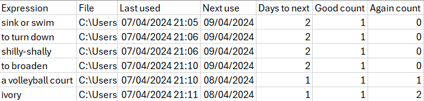
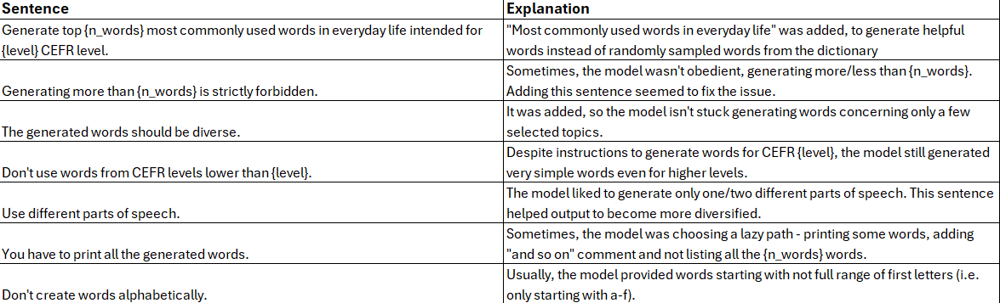
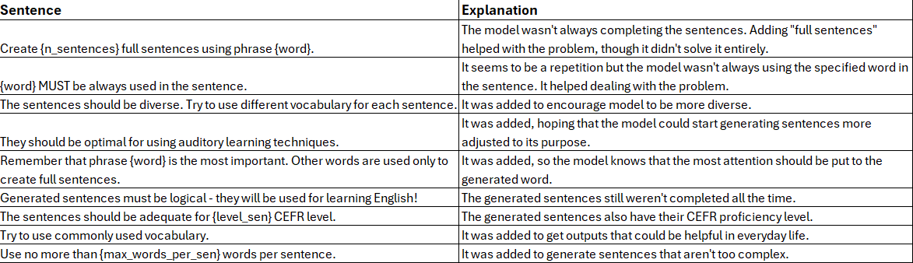

# auditory_learning_app
 
## Introduction
The objective of the project was to create an app that enables learning a language using auditory learning techniques (https://en.wikipedia.org/wiki/Auditory_learning).
It is in the format similar to flashcards - a recording of a phrase in one language is played and then the translation
into another language is provided (recordings not provided in the files). To maximally facilitate the learning process,
computer mouse button clicks are introduced. If a user was able to translate the sentence, a left mouse button should be
clicked, otherwise the right one. Thanks to that, no monitor screen is involved in the process. Provided that the user
owns a wireless mouse, the learning could be done in bed, allowing eyes to relax and concentrate solely on language
learning with a lector.

## How it works
The program was written in Python, using primarily pandas and numpy (to read/save files and update history) and pygame
(to run the samples) packages.

The sound samples should be copied to the project directory. Then, they will be played for the user in the app. The order of running different samples is random,
however different samples are run after different amount of time, based on user's
answers to the questions and set parameters on how many samples should be played each time. The scenarios of user
answers are listed below:
* If the phrase wasn't understood by the user at all, it will be run again the next day,
* If the phrase was understood by the user but not immediately (right mouse button was clicked at least once), the sample
will be played again after 2 days,
* If the phrase was understood by the user, it will be played again after the number
of days being the next number from the Fibonacci sequence. This way, if the phrase is
easy for the user, it will be played again with increasing intervals of time.

The history of learning is stored in a history.csv file. The user could see there details about each phrase that was run
at least once - when it was played the last time, when it will be played again or how many times the user didn't understand the phrase. An example
fragment of history.csv output is presented below.

## How to run
The project was created using Python 3.11.5 with Windows 10. Below are listed steps on how to run the tool.

1. Clone this repository.
2. Create a virtual environment for the project and install there packages from requirements (`pip install -r requirements.txt`)
3. Create directories with sound samples to run. They should be placed withing the cloned repo.
   1. Generating your own samples will be available soon. However, they will be only intended for learning English for now.
   2. Examples of generated recordings will be also available after samples generation is implemented.
4. Run main.py script. Click left mouse button if the phrase was understood, otherwise the right one.
   1. If your samples aren't in the .mp3 format, change `FORMAT = '.mp3'` line to the desired format.
   2. If you wish, you can change `NUM_SAMPLES_REPEAT = 5` and `NUM_SAMPLES_NEW = 3` lines that refer to, respectively,
a number of historical samples to play and a number of new samples not yet played.
5. To run the program again, run main.py script once again.

## Samples generation
Samples generation creates samples to learn English. Possibly, other languages will be supported when a multilingual Llama3 model is published.
For now, only generating words with their use in sentences is created. An example of sentence generation is provided in words_with_sentences.csv.

The completed steps of samples generation and the remaining ones are listed below:
1. Generate words in English using LLama3 model.
2. Generate sentences containing the generated words using Llama3 model.
3. [To do] Translate words to another language.
4. [To do] Translate sentences to another language.
5. [To do] Use text-to-speech model to create recordings based on generated sentences.
6. [To do] Evaluate results, fine-tune models if necessary.
   1. Examine if generated words are adequate for the given CEFR level
   2. Make sure that generated sentences are logical.
   3. Assess translation performance.

### Prompt engineering
The process of generating prompts is presented below. It explains why different sentences were added to the prompts.
1. Word generation:

2. Sentence generation:

### Issues
Keep in mind that the output of words/sentences generation is not completely stable. Sometimes it still tends to ignore some of the instructions.
Some observed issues where models don't follow instructions include:
- generating words alphabetically, with the first letter between a-f, ignoring words starting with further letters,
- generating words without alphabetical order only for some initial words, followed by words in alphabetical order that don't cover full first letter scope,
- misunderstanding what word generation means and creating many words as one example,
- keep generating similar phrases. Once, the model generated 'three times', 'five times' and then continued with larger numbers, ending with 'googolplex times'.
Another time, its interest was with many different types of cheese or sauce,
- ignoring some parts of speech,
- most sentences are logical but not all of them,
- some sentences seem to not be finished.

## Future ideas
1. Create a config file for number of old/new samples and other parameters.
2. Add a functionality to add and save historical results to SQL.
3. Add next_sound functionality - a sound signal that informs that a new sentence has just started.
4. Create a backup file (CSV/SQL) every month to not lose history by accident.
5. Expand the project by possible more advanced solutions:
   1. Generate images based on file names/sentences if available/audio content.
   2. Generate more examples with a given phrase.
   3. Add speach-to-text model that creates transcriptions from the recordings.
